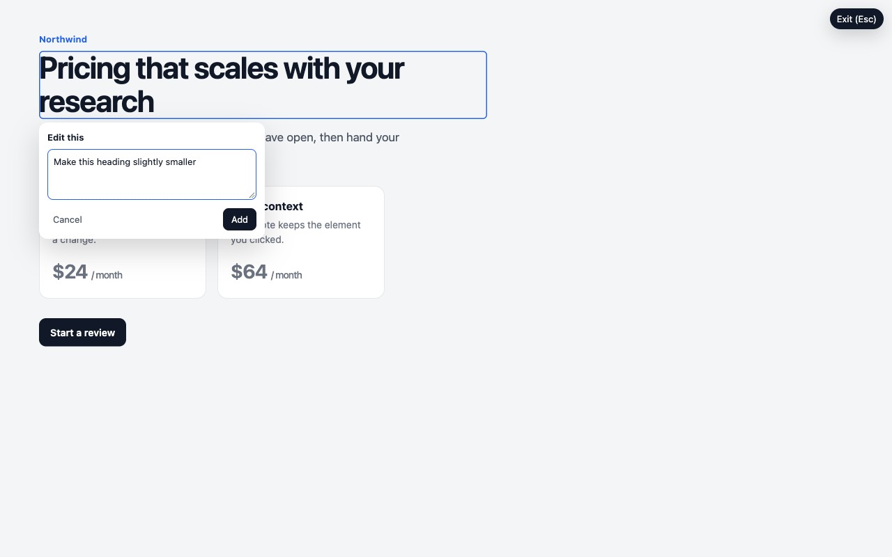

# EditUI

Chrome extension for pointing at a running UI, writing edit notes, and pasting one prompt into a coding agent.



Point at an element, leave a note, collect the batch, then copy one prompt. EditUI is agent-independent, Chrome-native, and batch-first. It uses copy and paste. No MCP server, repo connection, or account is required.

Made by [Usercall](https://usercall.com). Site: [editui.app](https://www.editui.app). Install from the [Chrome Web Store](https://chromewebstore.google.com/detail/editui/kolehloegjbpkeehflbdkjkdmljobfak).

This repo has store screenshots, not an animated GIF. The still above is `store/screenshots/01-point-and-prompt.jpg`. The site has an interactive demo.

## What it does

You review the page already open in Chrome, including localhost. Click the elements you want changed and write a short note on each one. EditUI copies a single prompt with the page, the element, and enough DOM context for a coding agent to make the change. The extension does not edit source files.

## Workflow

Point → Prompt → Collect → Send

1. **Point.** Turn on Edit Mode and click a live element.
2. **Prompt.** Write the change you want.
3. **Collect.** Keep reviewing. EditUI remembers every note.
4. **Send.** Copy the whole batch and paste it into a coding agent.

## Agents

The prompt is plain text on the clipboard.

- Claude Code
- Cursor
- Codex
- Any other agent, or any editor, that can take a paste

## Privacy

The extension is local-first.

- Notes stay in `chrome.storage.local` on your device.
- The content script is registered for all URLs so the toolbar button and shortcut can start a review. It does not read the page until you turn Edit Mode on.
- Page content leaves the browser only when you copy a prompt and paste it into a tool you choose.
- The extension does not use an account, a backend, or MCP.
- The marketing site in `apps/web` can send page views to Vercel Web Analytics. The extension does not.

Details are in [`store/privacy-policy.md`](store/privacy-policy.md).

## Extension

Use Node.js 22 and pnpm 10.

```bash
pnpm install
pnpm dev
```

In Chrome, open `chrome://extensions`, turn on Developer mode, and load `output/chrome-mv3` as an unpacked extension. Click the toolbar icon, or press Command-Shift-E (Ctrl-Shift-E), to enter Edit Mode.

```bash
pnpm build
pnpm zip
pnpm test
pnpm typecheck
pnpm test:e2e
```

`pnpm dev` and `pnpm build` write the extension to `output/chrome-mv3`. `pnpm zip` writes a Chrome Web Store package under `output/`. `pnpm test:e2e` builds the extension and opens a headed Chromium window, so it needs a display. Store listing copy is in [`store/listing.md`](store/listing.md).

## Marketing site

```bash
pnpm dev:web
pnpm build:web
pnpm typecheck:web
```

The dev server runs at <http://localhost:3333>. Optional environment variables are in [`.env.example`](.env.example). None are required to develop the extension or the site.

## Contributing

See [CONTRIBUTING.md](CONTRIBUTING.md).

## License

[MIT](LICENSE). The npm packages in this repo stay `private` so they are not published to the npm registry.
