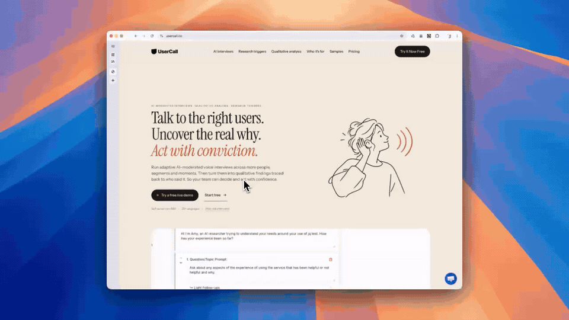

# EditUI



[](https://chromewebstore.google.com/detail/editui/kolehloegjbpkeehflbdkjkdmljobfak)

[Add EditUI to Chrome](https://chromewebstore.google.com/detail/editui/kolehloegjbpkeehflbdkjkdmljobfak)

You can see the UI bug, and the agent cannot, so stop describing which element.


Three edits collected on one page. The store screenshots stop at three.

Works with Claude Code / Cursor / Codex

Click the element, write the note, keep going, then paste one prompt. No account, no repo setup, and no MCP.

Made by [Usercall](https://usercall.co). Site: [editui.app](https://www.editui.app).

The clip above is the demo from [this Reddit post](https://www.reddit.com/r/ClaudeCode/comments/1wvo13p/i_got_tired_of_explaining_tiny_ui_fixes_to_claude/). [Play the video file](docs/editui-demo.mp4).

## How it works

Point → Prompt → Collect → Send

1. **Point.** Turn on Edit Mode and click a live element.
2. **Prompt.** Write the change you want.
3. **Collect.** Keep reviewing. Every note stays in the batch.
4. **Send.** Copy the batch and paste it into Claude Code, Cursor, Codex, or anywhere else that takes text.

## Privacy

The extension is local-first. Notes stay in `chrome.storage.local` until you copy a prompt and paste it yourself. The content script is on every page so the toolbar button can start a review, and it does not read the page until Edit Mode is on. The extension has no account and no backend. Details are in [`store/privacy-policy.md`](store/privacy-policy.md).

## Build the extension

Node.js 22 and pnpm 10.

```bash
pnpm install
pnpm dev
```

Load `output/chrome-mv3` at `chrome://extensions` as an unpacked extension. The toolbar icon, or Command-Shift-E (Ctrl-Shift-E), toggles Edit Mode.

```bash
pnpm build
pnpm zip
pnpm test
pnpm typecheck
```

`pnpm zip` writes the store package under `output/`. `pnpm test:e2e` needs a display. See [CONTRIBUTING.md](CONTRIBUTING.md).

## Marketing site

```bash
pnpm dev:web
pnpm build:web
```

The site runs at <http://localhost:3333>. Optional public settings are in [`.env.example`](.env.example).

## License

[MIT](LICENSE)
